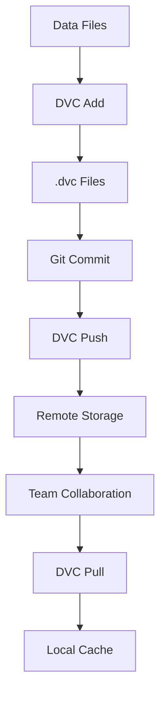
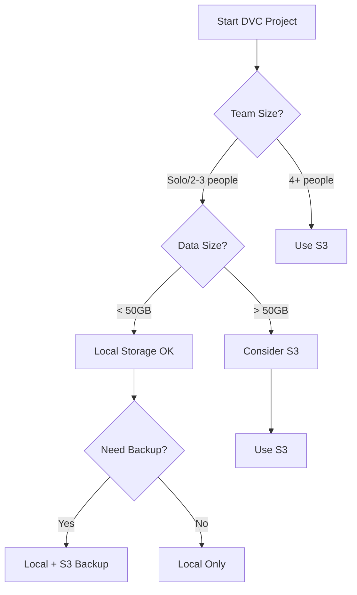
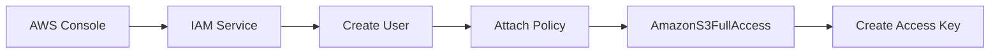

# DVC và AWS S3: Hướng Dẫn về Data Version Control

> **📚 Mục tiêu:** Hiểu rõ cách sử dụng DVC để quản lý phiên bản dữ liệu và tích hợp với AWS S3 làm remote storage

## Tổng Quan về DVC (Data Version Control)

DVC là một công cụ mạnh mẽ giúp quản lý phiên bản dữ liệu trong các dự án Machine Learning. Khác với Git chỉ quản lý code, DVC được thiết kế đặc biệt để xử lý các file dữ liệu lớn.

### Kiến Trúc Cơ Bản của DVC

DVC hoạt động dựa trên các thành phần chính:

1. **Local Cache**: Lưu trữ dữ liệu thực tế
2. **Metadata Files**: Các file `.dvc` chứa thông tin về dữ liệu
3. **Remote Storage**: Cloud storage (như AWS S3) để lưu trữ dữ liệu
4. **Git Integration**: Tích hợp với Git để quản lý metadata

### Quy Trình Hoạt Động



## I. Lý Thuyết và Khái Niệm Cốt Lõi

### A. Khởi Tạo và Quản Lý Dữ Liệu

#### 1. DVC Initialization
- **Local Init**: Khi khởi tạo DVC trong môi trường local, nó sẽ tạo cấu trúc cơ bản
- **Master Init**: Khi clone từ repository online, DVC sẽ tự động nhận diện và cấu hình

#### 2. Data Tracking Mechanism
DVC theo dõi dữ liệu thông qua:
- **Metadata Generation**: Tạo file `.dvc` chứa hash và thông tin về file gốc
- **Cache Management**: Lưu trữ dữ liệu trong cache local
- **Version Control**: Không ghi đè phiên bản cũ, tạo version mới

#### 3. Storage Architecture

```
Project Structure:
├── data/
│   └── raw/
│       ├── x_train_v1.npy
│       └── x_train_v1.npy.dvc
├── .dvc/
│   ├── cache/
│   └── config
└── .gitignore
```

### B. Liên Kết Dữ Liệu và Training Script

#### Mục Đích của Data Linking
Việc tạo file liên kết (symbolic link) giúp:
- **Script Compatibility**: Training script chỉ cần tên file đơn giản
- **Version Management**: Dễ dàng chuyển đổi giữa các phiên bản
- **Workflow Optimization**: Tách biệt logic training và quản lý dữ liệu

#### Cơ Chế Hoạt Động
```bash
# Tạo symbolic link
x_train.npy → x_train_v1.npy

# Khi script gọi x_train.npy
# DVC tự động resolve thành x_train_v1.npy
```

### C. Bảo Mật và Best Practices

#### AWS Security Model
- **Root User Avoidance**: Không sử dụng root user cho CLI access
- **IAM User Creation**: Tạo user với quyền hạn giới hạn
- **Principle of Least Privilege**: Chỉ cấp quyền cần thiết

#### S3 Bucket Naming
- **Global Uniqueness**: Tên bucket phải duy nhất trên toàn cầu
- **Naming Convention**: Sử dụng tên có ý nghĩa và dễ nhớ

## II. Quy Trình Thực Hiện Chi Tiết

### A. DVC Workflow Cơ Bản

#### Bước 1: Tải và Khởi Tạo Dữ Liệu

```bash
# Tải dữ liệu
python .\scripts\download_v1.py

# Khởi tạo DVC
dvc init
```

**Lưu ý quan trọng:**
- DVC init tạo cấu trúc thư mục `.dvc/`
- Cần cấu hình Git ignore cho cache

#### Bước 2: Tracking Dữ Liệu

```bash
# Bắt đầu theo dõi file dữ liệu
dvc add data\raw\x_train_v1.npy
```

**Kết quả:**
- Tạo file `x_train_v1.npy.dvc`
- Dữ liệu được lưu vào cache
- Metadata được tạo

#### Bước 3: Git Integration

```bash
# Commit metadata
git add x_train_v1.npy.dvc
git commit -m "Add training data v1"

# Sửa lỗi metadata nếu cần
git commit --amend
```

#### Bước 4: Remote Storage Push

```bash
# Push lần đầu
dvc push

# Push lần 2 (nếu cần force)
dvc push -f
```

### B. Chuẩn Bị Training Environment

#### Tạo Data Links

```bash
# Di chuyển đến thư mục data
cd data\raw

# Tạo symbolic link (Windows - cần quyền admin)
mklink x_train.npy x_train_v1.npy

# Hoặc trên Linux/Mac
ln -s x_train_v1.npy x_train.npy
```

#### Training Execution

```bash
# Về thư mục gốc
cd ../..

# Chạy training script
python train.py
```

### C. Version Management

#### Chuyển Đổi Phiên Bản

```bash
# Tải dữ liệu từ remote
dvc pull

# Chuyển Git version
git checkout <version_id>

# QUAN TRỌNG: Chuyển DVC version
dvc checkout
```

**⚠️ Lưu ý quan trọng:** Luôn chạy `dvc checkout` sau `git checkout` để đồng bộ dữ liệu.

## III. Lựa Chọn Storage Backend cho DVC

### A. Tại Sao Chọn AWS S3?

#### So Sánh Các Storage Options

| Storage Type | Ưu Điểm | Nhược Điểm | Use Case |
|:---:|:---:|:---:|:---:|
| **Local Storage** | - Miễn phí<br>- Tốc độ cao<br>- Kiểm soát hoàn toàn | - Không chia sẻ được<br>- Không backup<br>- Giới hạn dung lượng | Development, Testing |
| **AWS S3** | - Độ tin cậy cao<br>- Khả năng mở rộng<br>- Tích hợp tốt với ML tools<br>- Giá cả hợp lý | - Cần internet<br>- Chi phí storage | Production, Team Collaboration |
| **Google Cloud Storage** | - Tích hợp với GCP<br>- Performance tốt | - Vendor lock-in<br>- Chi phí | GCP-based projects |
| **Azure Blob** | - Tích hợp với Azure<br>- Enterprise features | - Phức tạp setup<br>- Chi phí | Enterprise, Azure ecosystem |

#### Lý Do Chọn S3 cho DVC:

1. **Cost-Effective**: 
   - Pay-as-you-use pricing model
   - Intelligent tiering cho cost optimization
   - Free tier 5GB cho 12 tháng đầu

2. **Reliability & Durability**:
   - 99.999999999% (11 9's) durability
   - Multi-AZ redundancy
   - Versioning support

3. **ML Ecosystem Integration**:
   - Tích hợp native với SageMaker
   - Hỗ trợ tốt cho ML pipelines
   - Compatible với nhiều ML frameworks

4. **Performance**:
   - Global CDN với CloudFront
   - Transfer acceleration
   - Parallel upload/download

5. **Security**:
   - IAM-based access control
   - Encryption at rest và in transit
   - VPC endpoints support

### B. Local Storage Configuration (Alternative)

#### Khi Nào Sử Dụng Local Storage?

```bash
# Cấu hình local storage
dvc remote add -d local_storage /path/to/local/storage

# Hoặc sử dụng network drive
dvc remote add -d network_storage //server/share/dvc-storage
```

**Use Cases cho Local Storage:**
- Development và testing
- Dự án cá nhân
- Môi trường air-gapped
- Prototype và proof-of-concept

#### Local Storage Setup

```bash
# Tạo thư mục storage
mkdir -p /path/to/dvc-storage

# Cấu hình DVC remote
dvc remote add -d local_storage /path/to/dvc-storage

# Test configuration
dvc push
dvc pull
```

**Cấu trúc Local Storage:**
```
/path/to/dvc-storage/
├── 3a/
│   └── 3a1b2c3d4e5f...  # File hash
├── 7f/
│   └── 7f8e9d0c1b2a...  # File hash
└── cache/
    └── files/
```

### C. Hybrid Storage Strategy

#### Multi-Remote Configuration

```bash
# Cấu hình multiple remotes
dvc remote add local /path/to/local/storage
dvc remote add s3 s3://your-bucket/dvc-storage
dvc remote add gcs gs://your-bucket/dvc-storage

# Set default remote
dvc remote default s3

# Push to specific remote
dvc push -r local
dvc push -r s3
```

#### Storage Strategy Matrix

| Environment | Primary Storage | Backup Storage | Reason |
|:---:|:---:|:---:|:---:|
| **Development** | Local | S3 | Speed + Backup |
| **Staging** | S3 | Local | Cloud + Local copy |
| **Production** | S3 | Cross-region S3 | Reliability + DR |

### D. Cost Analysis và Decision Framework

#### S3 Pricing Breakdown (2024)

| Storage Class | Price/GB/Month | Use Case |
|:---:|:---:|:---:|
| **Standard** | $0.023 | Frequently accessed data |
| **Standard-IA** | $0.0125 | Infrequently accessed data |
| **Glacier** | $0.004 | Archive data |
| **Glacier Deep Archive** | $0.00099 | Long-term backup |

#### Cost Comparison Example

**Scenario**: 100GB dataset, 10 versions

| Storage Type | Monthly Cost | Annual Cost | Notes |
|:---:|:---:|:---:|:---:|
| **Local (1TB SSD)** | $0 | $0 | One-time $100 investment |
| **S3 Standard** | $23 | $276 | Pay-as-you-use |
| **S3 + Lifecycle** | $8-15 | $96-180 | Auto-tiering to cheaper classes |

#### Decision Tree



#### Practical Examples

**Example 1: Personal ML Project**
```bash
# Small dataset, personal use
dvc remote add -d local /home/user/dvc-storage
# Cost: $0, Speed: Fast, Sharing: Manual
```

**Example 2: Team Project**
```bash
# Medium dataset, team collaboration
dvc remote add -d s3 s3://company-ml-data/dvc-storage
# Cost: ~$20/month, Speed: Good, Sharing: Automatic
```

**Example 3: Enterprise Project**
```bash
# Large dataset, multiple teams
dvc remote add -d s3 s3://enterprise-ml-data/dvc-storage
dvc remote add backup s3://enterprise-ml-backup/dvc-storage
# Cost: ~$200/month, Speed: Excellent, Sharing: Enterprise-grade
```

## IV. Cấu Hình AWS S3 làm DVC Remote Storage

### A. Tạo AWS Account và IAM User

#### Bước 1: AWS Account Setup

1. **Truy cập AWS Console**: https://aws.amazon.com/
2. **Tạo Account**: Điền thông tin và xác thực
3. **Chọn Free Tier**: Để tiết kiệm chi phí
4. **Payment Verification**: Cần thẻ tín dụng để xác minh

#### Bước 2: IAM User Creation



**Chi tiết thực hiện:**
1. Tìm dịch vụ IAM trong AWS Console
2. Chọn "People" → "Create a user"
3. Cấp quyền "AmazonS3FullAccess"
4. Tạo Access Key cho CLI

#### Bước 3: Access Key Management

**Thông tin cần lưu trữ:**
- Access Key ID
- Secret Access Key
- Region (ví dụ: us-east-1, ap-southeast-1)

**⚠️ Bảo mật:** Không thể xem lại Secret Access Key sau khi tạo.

### B. AWS CLI Installation và Configuration

#### Installation trên Windows

```bash
# Tải AWS CLI v2 từ trang chính thức
# Kiểm tra cài đặt
aws --version
```

#### Configuration

```bash
# Cấu hình AWS CLI
aws configure

# Nhập thông tin:
# AWS Access Key ID: [your-access-key]
# AWS Secret Access Key: [your-secret-key]
# Default region name: us-east-1
# Default output format: json
```

**Cấu trúc file cấu hình:**
```
~/.aws/
├── credentials
└── config
```

### C. S3 Operations và Testing

#### Basic S3 Commands

```bash
# Tạo S3 bucket
aws s3 mb s3://your-unique-bucket-name

# Liệt kê buckets
aws s3 ls

# Upload file
aws s3 cp local-file.txt s3://your-bucket/

# Download file
aws s3 cp s3://your-bucket/file.txt ./
```

#### DVC Remote Configuration

```bash
# Thêm remote storage
dvc remote add -d storage s3://your-bucket-name

# Cấu hình credentials
dvc remote modify storage access_key_id YOUR_ACCESS_KEY
dvc remote modify storage secret_access_key YOUR_SECRET_KEY
```

## IV. Best Practices và Troubleshooting

### A. Workflow Best Practices

#### 1. Data Organization
```
project/
├── data/
│   ├── raw/           # Dữ liệu thô
│   ├── processed/     # Dữ liệu đã xử lý
│   └── external/      # Dữ liệu từ nguồn ngoài
├── models/            # Model artifacts
├── scripts/           # Training scripts
└── notebooks/         # Jupyter notebooks
```

#### 2. Git Integration
```bash
# .gitignore cho DVC
.dvc/
*.dvc
data/raw/*.npy
data/raw/*.csv
```

#### 3. Version Naming Convention
- `v1`, `v2`, `v3` cho major versions
- `v1.1`, `v1.2` cho minor updates
- Descriptive commit messages

### B. Common Issues và Solutions

#### Issue 1: DVC Checkout Forgotten
**Problem:** Dữ liệu không đồng bộ sau git checkout
**Solution:** Luôn chạy `dvc checkout` sau `git checkout`

#### Issue 2: Cache Corruption
**Problem:** Dữ liệu bị lỗi trong cache
**Solution:** 
```bash
dvc cache clean
dvc pull
```

#### Issue 3: Remote Connection Issues
**Problem:** Không thể kết nối đến S3
**Solution:** Kiểm tra credentials và network

#### Issue 4: Local Storage Permissions
**Problem:** Không thể write vào local storage
**Solution:**
```bash
# Kiểm tra permissions
ls -la /path/to/dvc-storage

# Fix permissions
chmod 755 /path/to/dvc-storage
chown -R $USER:$USER /path/to/dvc-storage
```

#### Issue 5: Local Storage Full
**Problem:** Hết dung lượng local storage
**Solution:**
```bash
# Kiểm tra disk usage
df -h /path/to/dvc-storage

# Clean unused cache
dvc cache clean --unused

# Move to different location
dvc remote modify local_storage url /new/path/to/storage
```

#### Issue 6: Network Drive Issues
**Problem:** Không thể access network drive
**Solution:**
```bash
# Test network connectivity
ping server-name

# Check mount status
mount | grep network-drive

# Remount if needed
sudo mount -t cifs //server/share /mnt/dvc-storage
```

### C. Performance Optimization

#### 1. Cache Management
```bash
# Xem cache usage
dvc cache dir

# Clean unused cache
dvc cache clean --unused
```

#### 2. Parallel Operations
```bash
# Push với parallel jobs
dvc push -j 4
```

## V. Advanced Features

### A. Data Pipelines

DVC hỗ trợ tạo data pipelines:

```yaml
# dvc.yaml
stages:
  prepare:
    cmd: python scripts/prepare.py
    deps:
    - data/raw
    outs:
    - data/processed

  train:
    cmd: python scripts/train.py
    deps:
    - data/processed
    - scripts/train.py
    outs:
    - models/model.pkl
```

### B. Experiment Tracking

```bash
# Chạy experiment
dvc exp run

# So sánh experiments
dvc exp show
```

### C. Data Lineage

DVC tự động track data lineage:
- Input dependencies
- Output artifacts
- Transformation steps

## Kết Luận

DVC cung cấp sự linh hoạt trong việc lựa chọn storage backend, từ local storage cho development đến cloud storage cho production:

### Lợi Ích Chính:
1. **Version Control**: Quản lý phiên bản dữ liệu hiệu quả
2. **Storage Flexibility**: Hỗ trợ nhiều loại storage backend
3. **Cost Optimization**: Lựa chọn storage phù hợp với budget
4. **Collaboration**: Dễ dàng chia sẻ dữ liệu trong team
5. **Storage Efficiency**: Chỉ lưu trữ thay đổi, tiết kiệm không gian
6. **Reproducibility**: Đảm bảo tính tái tạo của experiments
7. **Scalability**: Hỗ trợ dữ liệu lớn với cloud storage

### Storage Selection Strategy:

#### 🏠 **Local Storage** - Khi nào sử dụng:
- Dự án cá nhân hoặc team nhỏ (< 4 người)
- Dữ liệu < 50GB
- Development và testing
- Môi trường air-gapped
- Budget hạn chế

#### ☁️ **AWS S3** - Khi nào sử dụng:
- Team collaboration (4+ người)
- Dữ liệu > 50GB
- Production environment
- Cần backup và disaster recovery
- Tích hợp với ML pipeline

#### 🔄 **Hybrid Approach** - Khi nào sử dụng:
- Development local + Production S3
- Multiple environments
- Cost optimization
- Gradual migration

### Workflow Tối Ưu:
1. **Planning**: Đánh giá requirements và chọn storage strategy
2. **Setup**: Cấu hình DVC với storage backend phù hợp
3. **Development**: Sử dụng DVC cho data versioning
4. **Collaboration**: Push/pull dữ liệu qua remote storage
5. **Production**: Deploy với data pipeline
6. **Monitoring**: Theo dõi storage usage và cost

### Key Takeaways:

- **Start Simple**: Bắt đầu với local storage cho dự án nhỏ
- **Scale Gradually**: Chuyển sang cloud storage khi cần thiết
- **Cost Awareness**: Monitor storage costs và optimize
- **Backup Strategy**: Luôn có backup plan
- **Team Alignment**: Đảm bảo team hiểu storage strategy

Việc nắm vững DVC và các storage options sẽ giúp bạn xây dựng một MLOps pipeline chuyên nghiệp, hiệu quả và cost-effective.

---

> **💡 Tip:** Bắt đầu với local storage để làm quen với DVC workflow, sau đó migrate sang S3 khi dự án phát triển. Luôn có backup strategy và monitor storage costs!
