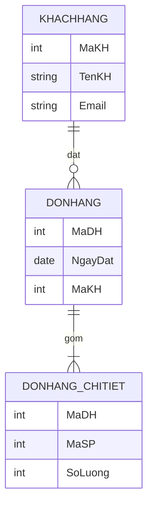
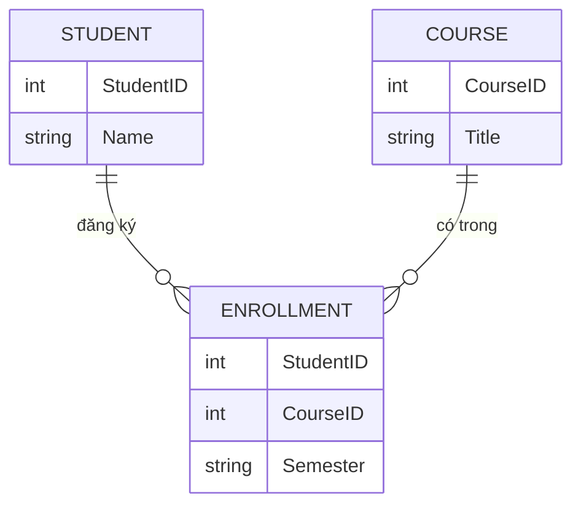
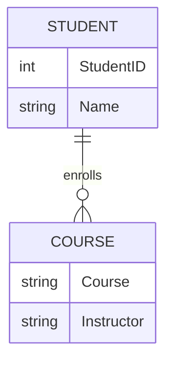
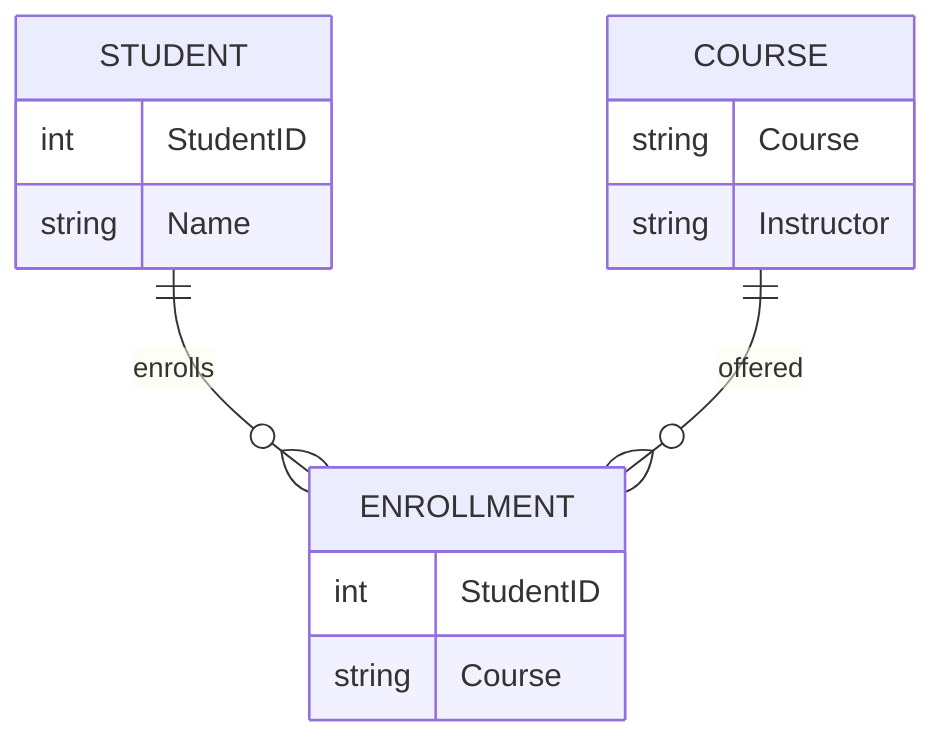
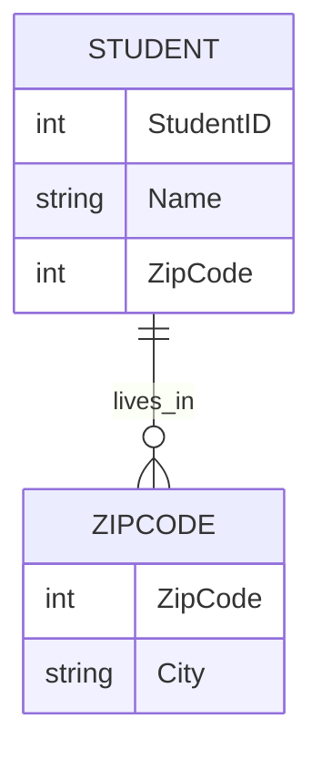
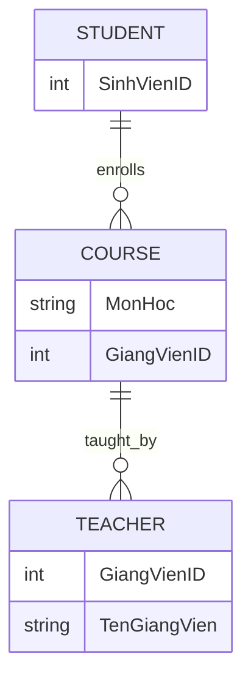
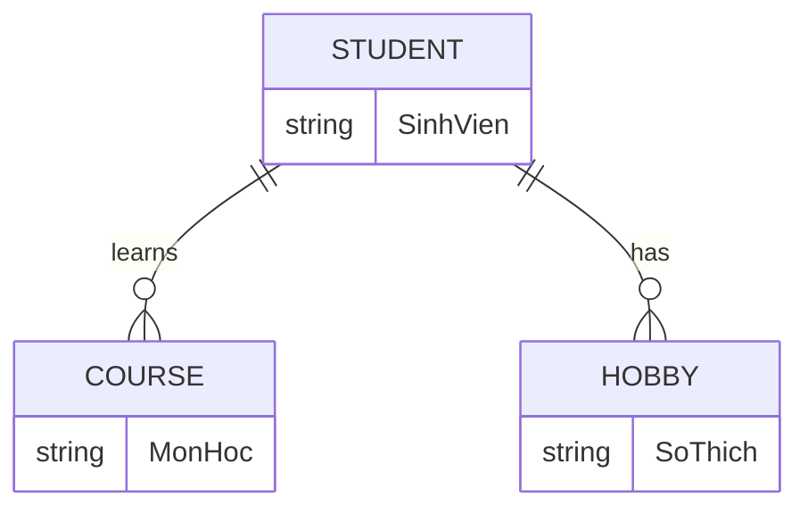
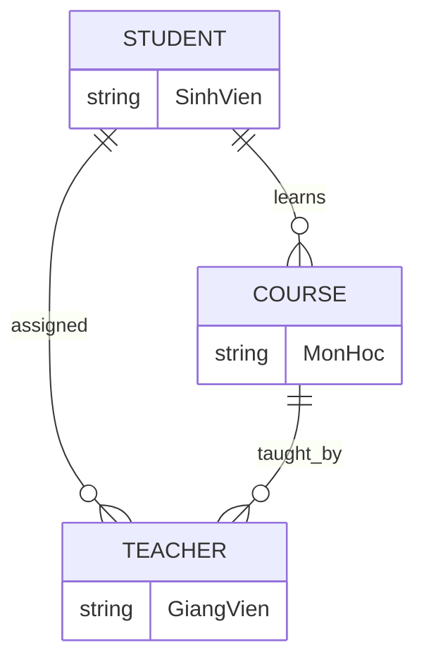

# Làm chủ các Kiến Thức Cơ Bản về Cơ Sở Dữ Liệu: ERD, Chuẩn Hóa và Truy Vấn SQL

Trong thế giới dữ liệu, việc hiểu cách cấu trúc, tối ưu hóa và tương tác với thông tin là vô cùng quan trọng. Bài blog này sẽ đưa chúng ta đi sâu vào ba trụ cột cơ bản của quản lý cơ sở dữ liệu: Sơ đồ Thực thể-Mối quan hệ (ERD), Chuẩn hóa Cơ sở dữ liệu và các Truy vấn SQL thiết yếu.

---

## 1. Khám phá Cấu trúc Cơ sở dữ liệu với Sơ đồ Thực thể-Mối quan hệ (ERD)

Sơ đồ Thực thể-Mối quan hệ (ERD) là một biểu diễn trực quan về các thực thể khác nhau trong một hệ thống và cách chúng liên quan đến nhau. Đây là công cụ mạnh mẽ để thiết kế và mô hình hóa các cơ sở dữ liệu quan hệ, thể hiện cấu trúc logic của dữ liệu. ERD giúp chúng ta "hiểu" và "mô hình hóa" một bài toán, chỉ ra những thành phần nào tồn tại và chúng liên quan với nhau như thế nào.

### **Ký hiệu Chen trong ERD**
- **Thực thể (Entity):** Hình chữ nhật, tên là danh từ số ít. Ví dụ: `Khách hàng`, `Đơn hàng`.
- **Thực thể yếu (Weak Entity):** Phụ thuộc vào thực thể khác, không xác định duy nhất bằng thuộc tính của nó. Ví dụ: `Order Item` phụ thuộc vào `Order`.
- **Thực thể kết hợp (Associative Entity):** Đại diện cho bảng trung gian trong quan hệ nhiều-nhiều. Ví dụ: `StudentCourse` kết nối `Student` và `Course`.
- **Thuộc tính (Attribute):** Hình bầu dục, mô tả đặc điểm của thực thể. Có thể là:
  - **Khóa (Key Attribute):** Gạch dưới, xác định duy nhất thực thể.
  - **Tổng hợp (Composite):** Có thể chia nhỏ, ví dụ: `Địa chỉ`.
  - **Đa trị (Multivalued):** Có nhiều giá trị, ví dụ: `Sở thích`.
  - **Dẫn xuất (Derived):** Tính toán từ thuộc tính khác, ví dụ: `Tuổi` từ `Ngày sinh`.
- **Mối quan hệ (Relationship):** Hình thoi, nối các thực thể. Các loại:
  - Một-một (1:1)
  - Một-nhiều (1:N)
  - Nhiều-nhiều (M:N)
- **Ràng buộc tham gia (Participation Constraints):**
  - **Toàn bộ (Total):** Đường đôi, mọi thực thể phải tham gia.
  - **Một phần (Partial):** Đường đơn, không phải mọi thực thể đều tham gia.

### **Ví dụ ERD (Chen Notation)**



### **So sánh ERD, Class Diagram và Database Schema**
- **ER Diagram:** Phân tích bài toán, mô hình hóa các thành phần và quan hệ.
- **Database Schema:** Thiết kế dữ liệu thực tế cho CSDL quan hệ dựa trên ERD.
- **Class Diagram:** Thiết kế lớp trong lập trình, tương thích với Database Schema.
- **ORM:** Ánh xạ giữa lớp (code) và bảng (CSDL).

### **Nét đứt và nét liền trong ERD**
- **Nét đứt (Dashed Line):** Quan hệ không xác định (weak foreign key), khóa ngoại không nằm trong khóa chính bảng con.
- **Nét liền (Solid Line):** Quan hệ xác định (identifying), khóa ngoại là một phần của khóa chính bảng con.

### **1.1. Sơ đồ ERD: Chen vs Crow's Foot**

### **A. Sơ đồ ERD dạng Chen (Mermaid)**



**Giải thích thành phần (Chen):**
- **Hình chữ nhật (Entity):** Đại diện cho thực thể (STUDENT, COURSE, ENROLLMENT).
- **Hình thoi (Relationship):** Mermaid không vẽ thoi, nhưng thể hiện quan hệ bằng đường nối và nhãn ("đăng ký", "có trong").
- **Hình bầu dục (Attribute):** Trong Mermaid, thuộc tính là các trường bên trong entity.
- **Ký hiệu |o--o{:** Thể hiện quan hệ 1-nhiều (1 student có thể đăng ký nhiều enrollment).

### **B. Sơ đồ ERD dạng Crow's Foot**


**Giải thích thành phần (Crow's Foot):**
- **Hình chữ nhật:** Đại diện cho entity (Student, Course, Enrollment).
- **Đường nối có chân gà (Crow's Foot):** Thể hiện quan hệ nhiều (many). Ví dụ: Một Student có thể có nhiều Enrollment (1-n), một Course cũng có thể có nhiều Enrollment.
- **Đường thẳng đơn:** Thể hiện quan hệ một (one).
- **Hình tròn ở đầu đường:** Thể hiện optional (có thể có hoặc không).
- **Gạch dọc:** Thể hiện bắt buộc (must have).
- **Bảng trung gian (Enrollment):** Dùng để biểu diễn quan hệ nhiều-nhiều giữa Student và Course.

### **So sánh nhanh**
- **Chen:** Dễ đọc, phù hợp lý thuyết, nhấn mạnh quan hệ.
- **Crow's Foot:** Phổ biến thực tế, trực quan về số lượng (1, nhiều, bắt buộc, tùy chọn).

---

## 2. Chuẩn hóa Cơ sở dữ liệu: Định nghĩa, ví dụ và sơ đồ từng bước

### Định nghĩa từng dạng chuẩn hóa

**1NF (First Normal Form):**
- Mỗi ô trong bảng chỉ chứa một giá trị duy nhất (nguyên tử), không có thuộc tính đa trị hay lồng bảng.

**2NF (Second Normal Form):**
- Bảng ở 1NF và mọi thuộc tính không khóa đều phụ thuộc hoàn toàn vào toàn bộ khóa chính (loại bỏ phụ thuộc một phần).

**3NF (Third Normal Form):**
- Bảng ở 2NF và không có phụ thuộc bắc cầu (transitive dependency) giữa các thuộc tính không khóa.

**BCNF (Boyce-Codd Normal Form):**
- Bảng ở 3NF và với mọi phụ thuộc hàm X → Y, X là siêu khóa.

**4NF (Fourth Normal Form):**
- Bảng ở BCNF và không có phụ thuộc đa trị không tầm thường mà vế trái không phải là siêu khóa.

**5NF (Fifth Normal Form):**
- Bảng ở 4NF và mọi phụ thuộc kết nối (join dependency) đều là hệ quả của các khóa.

---

### Ví dụ chuẩn hóa từng bước (có bảng và sơ đồ)

#### **Bảng chưa chuẩn hóa (Unnormalized Table):**
| StudentID | Name   | Courses         | Instructor |
|-----------|--------|----------------|------------|
| 1         | An     | Math, Physics  | Mr. A      |
| 2         | Bình   | Math           | Mr. B      |

#### **1NF: Tách giá trị đa trị thành từng dòng**
| StudentID | Name   | Course  | Instructor |
|-----------|--------|---------|------------|
| 1         | An     | Math    | Mr. A      |
| 1         | An     | Physics | Mr. A      |
| 2         | Bình   | Math    | Mr. B      |



#### **2NF: Loại bỏ phụ thuộc một phần**
- Nếu khóa chính là (StudentID, Course), Instructor chỉ phụ thuộc vào Course.
- Tách Instructor ra bảng riêng:

| Course  | Instructor |
|---------|------------|
| Math    | Mr. A      |
| Physics | Mr. A      |

| StudentID | Name   | Course  |
|-----------|--------|---------|
| 1         | An     | Math    |
| 1         | An     | Physics |
| 2         | Bình   | Math    |



#### **3NF: Loại bỏ phụ thuộc bắc cầu**
- Nếu có thêm ZipCode và City, City phụ thuộc vào ZipCode, ZipCode phụ thuộc vào StudentID.

| StudentID | Name   | ZipCode | City   |
|-----------|--------|---------|--------|
| 1         | An     | 70000   | HCM    |
| 2         | Bình   | 10000   | Hanoi  |

- Tách City ra bảng riêng:
| ZipCode | City   |
|---------|--------|
| 70000   | HCM    |
| 10000   | Hanoi  |

| StudentID | Name   | ZipCode |
|-----------|--------|---------|
| 1         | An     | 70000   |
| 2         | Bình   | 10000   |



#### **BCNF: Loại bỏ mọi phụ thuộc mà vế trái không phải siêu khóa**
- Ví dụ: GiangVienID → TenGiangVien nhưng GiangVienID không phải siêu khóa.

| SinhVienID | MonHoc | GiangVienID | TenGiangVien |
|------------|--------|-------------|--------------|
| 1          | Toán   | 101         | A            |
| 2          | Lý     | 102         | B            |

- Tách TenGiangVien ra bảng riêng:
| GiangVienID | TenGiangVien |
|-------------|--------------|
| 101         | A            |
| 102         | B            |

| SinhVienID | MonHoc | GiangVienID |
|------------|--------|-------------|
| 1          | Toán   | 101         |
| 2          | Lý     | 102         |



#### **4NF: Loại bỏ phụ thuộc đa trị**
- Ví dụ: Một sinh viên có thể học nhiều môn và có nhiều sở thích độc lập.

| SinhVien | MonHoc | SoThich |
|----------|--------|---------|
| An       | Toán   | Đọc     |
| An       | Toán   | Bóng đá |
| An       | Lý     | Đọc     |
| An       | Lý     | Bóng đá |

- Tách thành hai bảng:
| SinhVien | MonHoc |
|----------|--------|
| An       | Toán   |
| An       | Lý     |

| SinhVien | SoThich |
|----------|---------|
| An       | Đọc     |
| An       | Bóng đá |



#### **5NF: Loại bỏ dư thừa khi tái tạo bảng từ các phép chiếu**
- Ví dụ: Một bảng lưu thông tin về SinhVien, MonHoc, GiangVien, mỗi quan hệ độc lập.

| SinhVien | MonHoc | GiangVien |
|----------|--------|-----------|
| An       | Toán   | A         |
| An       | Lý     | B         |
| Bình     | Toán   | A         |

- Tách thành các bảng nhỏ hơn:
| SinhVien | MonHoc |
|----------|--------|
| An       | Toán   |
| An       | Lý     |
| Bình     | Toán   |

| SinhVien | GiangVien |
|----------|-----------|
| An       | A         |
| An       | B         |
| Bình     | A         |

| MonHoc | GiangVien |
|--------|-----------|
| Toán   | A         |
| Lý     | B         |



---

## 3. Tương tác với Dữ liệu bằng Truy vấn SQL

Sau khi thiết kế và chuẩn hóa, SQL là cách bạn truy vấn và thao tác dữ liệu.

### **Các phép JOIN cơ bản:**
- **INNER JOIN:** Lấy bản ghi khớp ở cả hai bảng.
- **SELF JOIN:** Join một bảng với chính nó (dùng bí danh).
- **JOIN nhiều bảng:** Kết hợp dữ liệu từ nhiều bảng.
- **COMPOUND JOIN CONDITION:** Join với nhiều cột khóa chính.

### **Ví dụ SQL JOIN:**
```sql
-- INNER JOIN
SELECT o.id, c.name, c.email
FROM orders o
INNER JOIN customers c ON o.customer_id = c.id;

-- SELF JOIN
SELECT e1.name AS employee, e2.name AS manager
FROM employees e1
LEFT JOIN employees e2 ON e1.reports_to = e2.employee_id;

-- JOIN nhiều bảng
SELECT o.id, o.order_date, c.name, s.status_name
FROM orders o
JOIN customers c ON o.customer_id = c.id
JOIN order_statuses s ON o.status_id = s.id;

-- COMPOUND JOIN
SELECT oi.*, o.*
FROM order_items oi
JOIN orders o ON oi.order_id = o.id AND oi.product_id = o.product_id;
```

---

## **Kết luận**
Hiểu biết về ERD, chuẩn hóa và các truy vấn SQL tạo nên nền tảng vững chắc cho việc quản lý cơ sở dữ liệu hiệu quả, cho phép bạn xây dựng các hệ thống dữ liệu mạnh mẽ, hiệu quả và đáng tin cậy. 